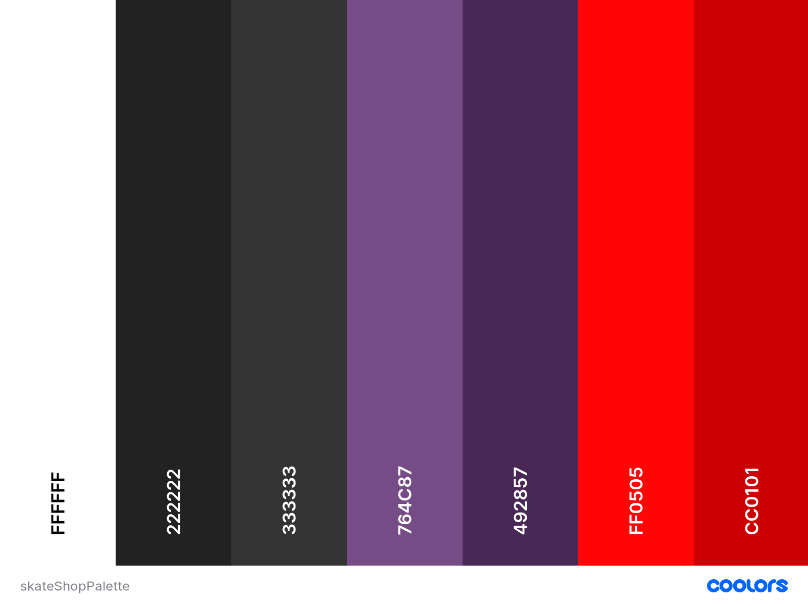

<h1 align="center">Skate Shop</h1>

[View the live project here.](https://kagebounshin-skateshop.herokuapp.com/)

<h2 align="center"></h2>

The SkateShop is a place where you can assemble a skateboard of you choice, or just buy single items for you setup. For the already experienced Skater to the more novice once. The company for this E-commerce web application is fictional, and this site is a assignment from [Code Institute](https://codeinstitute.net/). 

## Table Of Content
1.[**UX**](#user-experience) 
- [**User Stories**](#user-stories)
- [**Strategy**](#strategy)
- [**Scope**](#scope)
- [**Structure**](#structure)
- [**Skeleton**](#skeleton)
    - [**Wireframes**](#wireframes)
- [**Surface**](#surface)
    - [**Design**](#design)

2.[**Features**](#features)
- [**Features For The Future**](#features-for-the-future)

3.[**Technologies**](#technologies-used)

4.[**Testing**](#testing)

5.[**Database Setup**](#database-setup)

6.[**Deployment**](#deployment)

7.[**Credits**](#credits)
- [**Code**](#code)
- [**Media**](#media)
- [**Acknowledgements**](#acknowledgements)

---

## User Experience (UX)

-   ### User stories

    -   #### First Time Visitor Goals
        1. As a first time visitor, at the first look, I want to understand what the site is all about. for example, wich products you can purchase here.
        2.  As a first time visitor, I want the site to be easliy navigated, I would like to find what i'm searching for quick and easy.
        3.  As a first time visitor,  I want the site to be well structred the sites features should be where there expected to be.
        4.  As a first time visitor, I would like the site to look clean and modern. Good color matching, readble texts etc. 
        5.  As a first time visitor, I Would like to register to the page. 
        6.  As a first time visitor, I want to be able to contact the site owner if I have a problem or just need some information.

    -   #### Frequent User Goals
        1. As a Frequent User, I Like the login process to be smooth.
        2. As a Frequent User, I would like to access a profile page to manage my order history, and save personal details. 
        3. As a Frequent User, I if I lost my password, I want to have the choice to set a new password. 
        4. As a Frequent User, I want to search for specific products on the site. 
        5. As a Frequent User, I want to search for a specific category on the site.
        6. As a Frequent User, I would like to add products to my bag easily.
        7. As a Frequent User, I would like to remove/update products in my bag. 
        8. As a Frequent User, I want to see the shopping bag total amount all the time. 
        9. As a Frequent User, I want to review my cart	before checkout. 
        9. As a Frequent User, I want to View confirmation of order before completing purchase.
        10. As a Frequent User, I want to easily enter my payment information, so that the checkout is quick and easy. 
        11. As a Frequent User, I want to feel that my payment and personal information is secured. 
        12. As a Frequent User, I would like to get better shipping prices as my bags total increases. 

    -   #### Product Manager Goals
        1. As a Product Manager, I Would like to add, edit/update or delete products easily. 

---

- ### Strategy
    - This site will have it's focus on the already experienced skateboarder, to the more novice one. By having good product descirption and clear instructions on what you need to setup a skateboard, making it easy for the more novice user to assemble their own. Or the users will have the option to buy random gear to their setup in just a few clicks.
---

- ### Structure

- Framework
    - I've choose to go with bootrap as framework for this project. Easy to work with it's responsive grid system, lots of prebuilt components, and great plugins. 
- Navbar
    - The navbar will be fixed at the top of the page, so it's always accessible for the user. 
    - On Desktop view, the navbar will have the sites logo to the left, the produt links centered, an the search, account management and the bag links will be displayed to the right.
    - On Mobile and Tablet, the product links and the logo are hidden in a collapsable menu, show them by clicking at the burger menu. The search, account management and the bag links will still be displayed to the right.
    - The search bar will be in a dropdown menu both on deskttop, tablet & mobile view, always accesible and easy for the user to search for a product at any time. 
    - The account management links will be in a dropdown menu, wich will have the choices to register, login, logout, and your own profile page, with order history and personal information.  

- Home
    - The homepage, will greet you with the sites brand, and a paragrapf, this should be enough to explain the sites purpose. 
    - Below that, I want to make like a tutorial for how to setup a skateboard properly. explaining step by step what you need to get started. At each step, have the option to go to that specific product. 
- Products
    - You will have the choice to display all the product at the same time, or by category. Also display on or more specific products based on your search criteria. The products will have an image, name and a pricing displayed. 
    - Click on a product to read more about that product. Such as a short discripion, sizes etc. Have the option to add it to the bag, with the quantity of your choice. 
- Bag / Checkout
    - If the bag has no item, it will have a text, saying that the bag is empty. 
    - If you have added something to your bag, you will see the total price displayed next to the bag link at the navbar.
    - By clicking the bag link, See a quick preview of the bag and it's current products and total amount in a [toasts](). If the bag contains any products , they will have the option to checkout. 
    - When choosing the option to go to the checkout you will be able to increase or decrease the quantity of each item, remove a item from the bag, see the total amout, enter your shipping credentials and payment.
- Toast
    - Bootsrap has a component called ["Toasts"](), wich is notifications designed to mimic the push notifications.
    - The bag when clicked will show a quick preview of it's current products using the toast component. 
    - The toast component will also display warning, info, success or error messages, giving the user quick feedback, for example, if something unexcpected happens. 
- Register, Sign In/Out
    - These pages will be clean looking, centered at the page & be easily accessible at all time. 
- Contact 
    - At the contact page, you will be able to send mails to the sites admin. See other ways to contact the sites admins, and wich time of the day they reachable. 
    - The admin can access these emails from the admin terminal. 
 
---

- ### Skeleton
    - ### Wireframes
        - Mobile
            - [First](wireframes/wireframesMobile1.png)
            - [Second](wireframes/wireframesMobile2.png)
            - [Third](wireframes/wireframesMobile3.png)
        - Tablet
            - [Home](wireframes/tabletHome.png)
            - [Products](wireframes/tabletProduct.png)
            - [Info](wireframes/tabletInfo.png)
            - [Register](wireframes/tabletReg.png)
            - [Sign In](wireframes/tabletSign.png)
            - [Bag](wireframes/tabletBag.png)
            - [Toast](wireframes/tabletToast.png)
            - [Dropdown](wireframes/tabletDrop.png)
            - [Check](wireframes/tabletCheck.png)
        - Desktop
            - [Home](wireframes/wireframeHome.png)
            - [Products](wireframes/wireframeProducts.png)
            - [Info](wireframes/wireframeInfo.png)
            - [Register](wireframes/wireframeReg.png)
            - [Sign In](wireframes/wireframeSign.png)
            - [Bag](wireframes/wireframeBag.png)
            - [Toast](wireframes/wireframeToast.png)
            - [Check](wireframes/wireframeCheck.png)

---

- ### Surface

-   ### Design
    -   #### Colour Scheme
        - The body of this site and the navigationbar is set to have the background color of white (#ffffff). 
        - The footer has two section, the top section has the background color of "Jet" (#333333), the lower part of the footer has the background color of "Eerie Black" (#222222).
        - The site has four different types of CTA ("Call To Action") buttons. 
            - The first [Button](img-readme/ctabutton1.png) has the background color of "Razzmic Berry" (#764C87), and when ["Hovered"](img-readme/ctabutton2.png) the background color eases in to "Russian Violet" (#492857).
    <h2 class="text-center"></h2>
    

    -   #### Typography
        - The fonts I've used for this project are from [Google Fonts](https://fonts.google.com/). The fonts are ["Oswald"](img-readme/mainfont.png) & ["Pacifico"](img-readme/logofont.png).
            - [Oswald](https://fonts.google.com/?query=Oswald&preview.text=Oswald&preview.text_type=custom) has been used as the main font of this project. Looks really good in all the different weights, it's readble. Simpley a fine peace of sans serif typeface. 
            - [Pacifico](https://fonts.google.com/specimen/Pacifico?preview.text=Pacifico&preview.text_type=custom&category=Sans+Serif,Display,Handwriting,Monospace&query=Pacifico) is used for the sites [logo](img-readme/logo.png). The font is  inspired by the 1950s American surf culture. Works perfect for this site, becouse skateboarding was a sport created by surfers. 
    -   #### Imagery

    -   #### Icons

---

## Database Setup

### Schema
---
A relational database was used to structure this project. A relational database is a collection of data items with pre-defined relationships between them.

## Features

### Features for the future 

---

## Technologies Used

### Languages Used

-   [HTML5](https://en.wikipedia.org/wiki/HTML5)
-   [CSS3](https://en.wikipedia.org/wiki/Cascading_Style_Sheets)
-   [JavaScript](https://www.javascript.com/)
-   [Python](https://www.python.org/)

### Frameworks, Libraries & Programs Used

- [jQuery](https://jquery.com/) 

- [PostgreSQL](https://www.postgresql.org/) - Used to create relational databases

- [Bootstrap](https://getbootstrap.com/) - Front-end toolkit

- [Flask](https://flask.palletsprojects.com/en/1.1.x/) - The project uses Flask, which is a Python microframework. 

- [PyMongo](https://pypi.org/project/pymongo/) - The project uses PyMongo as the Python API for MongoDB. To link the backend data to frontend application. 

- [Jinja](https://jinja.palletsprojects.com/en/3.0.x/) - Jinja was used with flask in the HTML code. For simple linking between the backend and frontend. 

- [Heroku](https://id.heroku.com/login) - Heroku was used as the hosting platform to deploy my project.

- [FontAwesome](https://fontawesome.com/) - Provides icons across the site

- [icons8](https://icons8.com/) - Setup section.

- [GoogleFonts](https://fonts.google.com/) - Used for the sites typography

- [Git](https://git-scm.com/) - Git was used for version control.

- [GitHub](https://github.com/) - GitHub was used to store the project.

- [Balsamiq](https://balsamiq.com/) - Balsamiq was used to create the wireframes.

- [Am I Responsive](http://ami.responsivedesign.is/#) - Tested responsivness & the images at the top of the readMe.

- [Lighthouse](https://developers.google.com/web/tools/lighthouse) - Lighthouse was used to test the performanceof the website.

- [CSS Gradient](https://cssgradient.io/) - Linear Gradient Helper

- [favicon](https://favicon.io/) - Sites favicon

- [Coolors](https://coolors.co/) - For creating the colorpalette at the Design section of this README

- [Unsplash](https://unsplash.com/s/photos/skateboarders) - Images for the homepage

---

## Testing

### Lighthouse Testing

--- 

- Home 
    - [Desktop](pdf/home_desktop.pdf)
    - [Mobile](pdf/home_mobile.pdf)
- Bag 
    - [Desktop](pdf/bag_desktop.pdf)
    - [Mobile](pdf/bag_mobile.pdf)
- Checkout
    - [Desktop](pdf/checkout_desktop.pdf)
    - [Mobile](pdf/checkout_mobile.pdf)
- Contact 
    - [Desktop](pdf/contact_desktop.pdf)
    - [Mobile](pdf/contact_mobile.pdf)
- Product 
    - [Desktop](pdf/product_desktop.pdf)
    - [Mobile](pdf/product_mobile.pdf)
- Product Detail 
    - [Desktop](pdf/product_detail_desktop.pdf)
    - [Mobile](pdf/product_detail_mobile.pdf)
- Profile 
    - [Desktop](pdf/profile_desktop.pdf)
    - [Mobile](pdf/profile_mobile.pdf)

### Testing User Stories from User Experience (UX) Section

---

-   #### First Time Visitor Goals
  
-   #### Frequent User Goals

### Further Testing

### Known Bugs 

### Resolved Bugs

---

## Deployment

## Credits

### Code

### Media
### Acknowledgements

### Disclaimer
